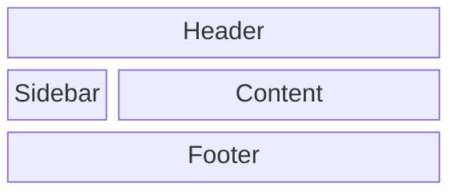

# UI Mockups Skill

When asked to produce UI mockups or wireframes in a text-based environment, use the following techniques to convey layout, structure, and visual hierarchy effectively.

## 1. ASCII / Markdown Art Wireframing
Use code blocks to draw literal representations of the UI. This is best for showing structural layout.

**Example:**
```text
+-------------------------------------------------------------+
|  [Logo]   Home   Features   Pricing               [Login]   |
+-------------------------------------------------------------+
|                                                             |
|   +---------------------------+   +---------------------+   |
|   |                           |   |                     |   |
|   |  Headline goes here       |   |      [ Image /      |   |
|   |  Sub-headline text that   |   |        Graphic ]    |   |
|   |  explains the value.      |   |                     |   |
|   |                           |   +---------------------+   |
|   |  [ Primary Call to Action]|                             |
|   +---------------------------+                             |
|                                                             |
+-------------------------------------------------------------+
```

## 2. Component and Hierarchy Breakdown
Describe the visual hierarchy using nested lists to explain how components stack and relate to each other. This is best for complex, data-heavy views.

**Example:**
*   **Navigation Bar (Top, Sticky)**
    *   Logo (Left)
    *   Search Bar (Center, expanding)
    *   User Profile Dropdown (Right)
*   **Main Content Layout (Two Column)**
    *   **Sidebar (Left, 250px)**
        *   Filter Categories (Accordion list)
        *   Price Range Slider
    *   **Product Grid (Right, Fluid)**
        *   Product Card 1 [Image | Title | Price | "Add to Cart" Button]
        *   Product Card 2 [Image | Title | Price | "Add to Cart" Button]

## 3. Mermaid Wireframe Diagrams
Use Mermaid block diagrams (using the architecture or flowchart syntax) to show the relationship of layout containers.

**Example:**


## 4. State & Interaction Specifications
Wireframes aren't just static. Constantly describe what happens on interaction.
- **Hover State:** Describe how the button changes (e.g., "Background darkens by 10%, cursor changes to pointer").
- **Empty State:** Explain what areas look like before data exists (e.g., "Show a subtle illustration of a ghost with the text 'No data found'").
- **Accessibility (A11y):** Note focus rings and ARIA requirements (e.g., "Tab focus ring must have a 2px solid primary-color outline").

## Best Practices for Text Mockups
- **Be Explicit:** Don't say "a good looking button." Say "a capsule-shaped button with a solid #0F172A background and white 14px uppercase text."
- **Iterate:** Show Version A and Version B side-by-side to give the user options.
- **Explain the *Why*:** Alongside the mockup, provide a brief paragraph explaining *why* this layout solves the user's problem better than alternatives.
